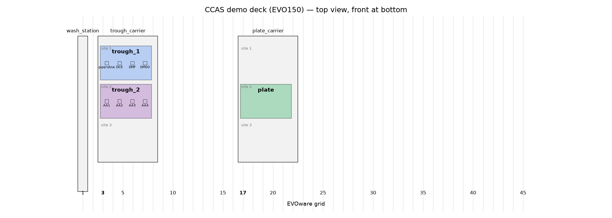

# CCAS_demo

This folder contains the current toy job and demonstration scripts for the 2026 restart of the 257 Tecan. The content here is more detailed than the repo-level summary and documents the active test workflow.

## Goal

This is a toy SPPS-style test job designed to validate the following actions:
- source handling in trough_1 and trough_2 (grid 3, sites 1 and 2)
- LiHa movement and deck location checks
- fixed-tip usage with the 8 steel LiHa tips, one dedicated tip per liquid
- aspiration, dispensing, and mixing steps only
- combinatorial amino acid ordering patterns across a 96-well destination plate

## Current workflow assumptions
Deck positions are defined in PLR in `ccas_deck.py` (EVOware grid/site numbering) and drawn in `ccas_deck.png`:



- Source 1: `trough_1` at grid 3, site 1
  - 4 compartments, left to right: piperidine (relabelled from H2O), DCE, DMF, DMSO (unused)
- Source 2: `trough_2` at grid 3, site 2
  - 4 compartments (same trough as trough_1), left to right: Fmoc-AA1 to AA4. Swap the open trough currently on site 2 for the 4-compartment one before running
- Destination: `plate` (96-well flat-bottom) at grid 17, site 2
  - Standard 1 mL capacity plate
- Tips: 8 fixed (steel) tips on the LiHa; no tip rack on the deck
- Only aspiration, dispensing, and mixing are included in this stage
- No heating, shaking, or downtime are modeled in the toy workflow
- Each liquid uses its own fixed tip (`LIQUID_CHANNELS` in `tecan_spps_run.py`): tips 1-3 for piperidine, DCE, DMF; tips 4-7 for AA1-AA4; tip 8 spare. Tips are not washed during the run, so wash them in EVOware before and after
- Source liquid level is assumed to be at least quarter full

## Actual job instructions for the toy SPPS-like run
For each well, the workflow should be structured as follows:

1. Combine the four Fmoc-protected amino acids in every possible order.
2. Use the remaining wells to perform the same pattern with all possible ordered combinations of only 2 of the 4 Fmoc-protected amino acids.
3. For every amino acid in the order assigned to a well:
   - add the Fmoc-AA
   - then add DMF
   - then add DCE
   - then add piperidine (deprotection agent)
   - then continue to the next Fmoc-AA in that sequence
4. Use the same reagent sequence for every well, while varying the order of amino acids from well to well.

This means the per-step reagent ordering is:

```text
Fmoc-AA -> DMF -> DCE -> piperidine -> next Fmoc-AA -> DMF -> DCE -> piperidine -> ...
```

The order of the amino acids is the key variable across the plate.

## Basic test flow
1. Confirm the grid/site constants at the top of `ccas_deck.py` match the actual Tecan configuration (grid 3 sites 1-2, grid 17 site 2).
2. Run the probe script to verify robot movement to the troughs and plate. It stops over A1 of each one, slowly lowers tip 1 halfway toward the labware so you can see where it is (`--lower-fraction` to change, 0 = stay raised), waits for Enter, then raises it again.
3. Confirm that the LiHa can move to the correct source wells without collision.
4. Confirm that the aspirate/dispense cycle responds correctly at the expected liquid height.
5. Only after the movement and fixed-tip logic are validated should the chemistry transfer workflow be expanded.

## Files in this folder
- `ccas_deck.py` - PyLabRobot deck definition (`build_deck()`); run it to print the layout and regenerate `ccas_deck.png`
- `ccas_deck.png` - top-down image of the PLR deck
- `probe_locations.py` - live (or `--dry-run`) deck probe that moves tip 1 over trough_1, trough_2 and the plate and lowers it halfway to show the position
- `demo_transfer.py` - generalized template for a simple transfer pattern
- `spps_toy_job.py` - combinatorial sequence planner for the toy SPPS job
- `tecan_spps_run.py` - Tecan-ready PyLabRobot script using the EVO backend
- `tecan_deck_layout.json` - old A1/A2/B2 deck map, superseded by `ccas_deck.py`
- `deck_layout.md` - schematic summary of the source and destination layout
- `requirements_demo.txt` - PyLabRobot install hint

## View the deck layout
From the repository root:

```bash
python CCAS_demo/ccas_deck.py
```

This prints the PLR deck summary and rewrites `CCAS_demo/ccas_deck.png`.

## Run the position probe
From the repository root:

```bash
python CCAS_demo/probe_locations.py
```

## Run the toy job planner
From the repository root:

```bash
python CCAS_demo/spps_toy_job.py
```

## Run the actual Tecan-ready job
From the repository root, after confirming `ccas_deck.py` matches the real instrument:

```bash
python CCAS_demo/tecan_spps_run.py
```

This is the version intended to be run on the Tecan with the installed PyLabRobot/EVO stack. It uses the 8 fixed tips, one per liquid, and follows the reagent ordering:

```text
Fmoc-AA -> DMF -> DCE -> piperidine
```

for each amino acid in the sequence assigned to a well.

## Environment setup
Install PyLabRobot and its optional USB dependencies in the environment used by the robot controller:

```bash
python -m pip install -r CCAS_demo/requirements_demo.txt
```

If PyLabRobot is already installed, install the USB extra into the active environment with:

```bash
python -m pip install "pylabrobot[usb]==0.2.1"
```

The USB extra is required for the EVO backend to open the robot connection. On Windows, the
Tecan's USB interface may also require a compatible libusb driver; resolve that separately if a
subsequent run reports that no USB device was found.

The demo dependency is pinned to PyLabRobot 0.2.1 to match the repository's `requirements.txt`.
Avoid mixing a different PyLabRobot version into the robot-control environment while debugging.

## Notes
- These scripts are intentionally simple and should be treated as demonstration/test starting points.
- The carrier model (`MP_3Pos`) and plate/trough labware in `ccas_deck.py` must be confirmed against the real Tecan setup before running on hardware. The trough z-heights are placeholders copied from `DeepWell_96_Well`.
- This repo is meant to support a toy representation of later SPPS actions, not a production synthesis workflow.
